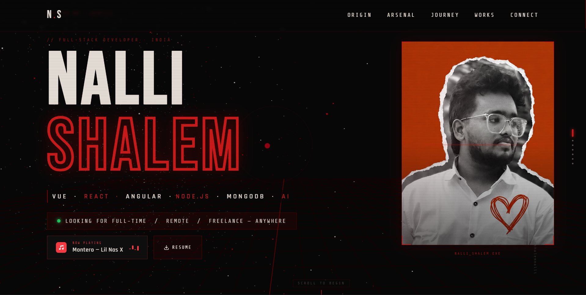

# 🎬 Nalli Shalem — Cinematic Portfolio

> A cinematic anime-style developer portfolio built with React, TypeScript, Vite, and Three.js.  
> Black & matte red theme. Scroll-driven 3D camera. Every section tells a chapter of the story.



---

## ⚡ Tech Stack

| Layer      | Tech                                      |
|------------|-------------------------------------------|
| Framework  | React 18 + TypeScript                     |
| Build Tool | Vite 5                                    |
| 3D Engine  | Three.js + React Three Fiber (@react-three/fiber) |
| Styling    | Global CSS (CSS Variables, no frameworks) |
| Fonts      | Bebas Neue · Rajdhani · Share Tech Mono   |

---

## 🚀 Getting Started

### 1. Install dependencies
```bash
npm install
```

### 2. Start dev server
```bash
npm run dev
```

### 3. Open in browser
```
http://localhost:5173
```

### 4. Build for production
```bash
npm run build
```

### 5. Preview production build
```bash
npm run preview
```

---

## 📁 Project Structure

```
nalli-portfolio/
├── public/
│   ├── profile.jpg          ← Your profile photo (replace this)
│   └── resume.pdf           ← Your resume PDF (replace this)
│
├── src/
│   ├── components/
│   │   ├── BackgroundScene.tsx  ← Three.js 3D canvas (particles, rings, camera travel)
│   │   ├── Nav.tsx              ← Fixed top navigation
│   │   ├── Hero.tsx             ← Hero section (name, photo, music, resume)
│   │   └── Sections.tsx         ← About, Skills, Experience, Projects, Certifications, Contact
│   │
│   ├── hooks/
│   │   ├── useScrollProgress.ts ← Smooth scroll 0–1 value for 3D camera
│   │   └── useScrollReveal.ts   ← IntersectionObserver reveal helper
│   │
│   ├── utils/
│   │   └── data.ts              ← ✏️ ALL your resume data lives here
│   │
│   ├── styles/
│   │   └── global.css           ← All styles (single global sheet)
│   │
│   ├── App.tsx                  ← Root component, scroll dots, observers
│   └── main.tsx                 ← React entry point
│
├── index.html
├── package.json
├── vite.config.ts
├── tsconfig.json
└── README.md
```

---

## ✏️ How to Customise

### Update your info
All resume data is in one file: **`src/utils/data.ts`**

```ts
// Personal details
export const PERSONAL = {
  name:     'Your Name',
  email:    'you@email.com',
  phone:    '+91 ...',
  linkedin: '/yourhandle',
  github:   '/yourgithub',
}
```

---

### Add a project
In `src/utils/data.ts`, add a block to `PROJECTS`:

```ts
{
  num:   '04',
  title: 'PROJECT NAME',
  tech:  ['React', 'Node.js', 'MongoDB'],
  desc:  'What you built and why it matters.',
  link:  'https://your-live-link.com',  // '' = no arrow button
},
```

---

### Add a certification
In `src/utils/data.ts`, add a block to `CERTIFICATIONS`:

```ts
{
  name:          'AWS Certified Developer',
  issuer:        'Amazon Web Services',
  year:          '2024',
  credentialUrl: 'https://credly.com/your-badge',  // '' = no verify button
  badge:         'AWS',  // GCP | AWS | META | UDEMY | COURSERA | MICROSOFT | CUSTOM
},
```

---

### Change the Now Playing song
In `src/components/Hero.tsx`:

```tsx
// 1. Change the link
href="https://music.apple.com/song/your-song-link"

// 2. Change the display text
<span className="hero-nowplaying-song">Song Name — Artist</span>
```

**To get an Apple Music link:** Open Apple Music → right-click any song → Share → Copy Link

---

### Replace your photo
Drop your photo into `/public/` and name it `profile.jpg`.  
Recommended: portrait crop, good contrast, minimum 800×1000px.

---

### Replace your resume
Drop your PDF into `/public/` and name it `resume.pdf`.  
It downloads as `Nalli_Shalem_Resume.pdf` when clicked.  
To change the download name, edit `Hero.tsx`:
```tsx
download="Your_Name_Resume.pdf"
```

---

## 🎨 Theme Colours

All colours are CSS variables in `src/styles/global.css`:

```css
--black:      #070707   /* Background */
--red:        #8b0000   /* Dark red */
--red-matte:  #a01010   /* Mid red */
--red-bright: #cc1a1a   /* Accent red */
--white:      #e8e0d8   /* Off-white text */
--dim:        #5a5050   /* Muted text */
```

---

## 📦 Deployment

### Vercel (recommended — free)
```bash
npm install -g vercel
vercel
```

### Netlify
```bash
npm run build
# Drag the /dist folder into netlify.com/drop
```

### GitHub Pages
```bash
# Add to vite.config.ts:
# base: '/your-repo-name/'
npm run build
# Push /dist to gh-pages branch
```

---

## 🗂️ Sections

| Chapter | Section       | Description                              |
|---------|---------------|------------------------------------------|
| 00      | Genesis       | Hero — name, photo, availability, music |
| 01      | Origin Story  | About — summary and stats                |
| 02      | The Arsenal   | Skills — tech stack grid                 |
| 03      | The Journey   | Experience — timeline                    |
| 04      | Legendary Works | Projects — built in fire               |
| 05      | Proof of Power | Certifications                          |
| 06      | The Call      | Contact                                  |

---

## 🐛 Common Issues

**Photo not showing**  
→ Make sure the file is named exactly `profile.jpg` inside the `/public/` folder.

**Resume not downloading**  
→ Make sure `resume.pdf` is inside `/public/`. Check browser console for 404.

**3D background not visible**  
→ Make sure your browser supports WebGL. Try Chrome or Edge.

**Sections not animating in**  
→ Scroll slowly — animations trigger on IntersectionObserver at 10–15% visibility.

**TypeScript errors after editing data.ts**  
→ Make sure badge values are exactly: `'GCP' | 'AWS' | 'META' | 'UDEMY' | 'COURSERA' | 'MICROSOFT' | 'CUSTOM'`

---

## 📄 License

Personal portfolio — feel free to use as a template.  
Built by Nalli Shalem · shalemn3@gmail.com
